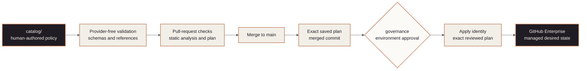

<!-- mindclade-doc: repository-home@1 -->

<!-- Brand source: mindclade/.github-private/mindclade-brand-assets (MONO family). -->

<p align="center">
  <picture>
    <source media="(prefers-color-scheme: dark)" srcset="docs/assets/brand/mono-wordmark-dark-1080w.png">
    <source media="(prefers-color-scheme: light)" srcset="docs/assets/brand/mono-wordmark-1080w.png">
    
  </picture>
</p>

# Mindclade · GitHub Configuration

> **Platform Foundation · GitHub governance control plane**
> Catalog-driven repositories, teams, access, environments, rulesets, Actions policy, and
> OIDC metadata for the Mindclade GitHub Enterprise organization.

| Repository contract | Value |
| --- | --- |
| Enterprise | [`mindclade`](https://github.com/enterprises/mindclade) |
| Organization | [`mindclade`](https://github.com/mindclade) |
| Repository index | [Mindclade repositories](https://github.com/orgs/mindclade/repositories) |
| Repository | [`mindclade/github-config`](https://github.com/mindclade/github-config) |
| Class | `enterprise-control` |
| Visibility | `private` |
| Owner | Security |
| Production authority | Yes |
| Change model | Pull request to `main`; exact post-merge plan; protected `governance` apply |
| Documentation | [`docs/README.md`](docs/README.md) |

`github-config` is the authoritative desired state for GitHub governance. Human-authored
policy starts in `catalog/`; Terraform validates and compiles it into GitHub resources.

## Authority boundary

### This repository owns

- repository inventory, visibility, custom properties, and lifecycle;
- teams and team-based access;
- protected environments;
- organization rulesets and mandatory ruleset workflows;
- GitHub Actions and OIDC policy;
- drift detection and documented manual controls.

### This repository excludes

It does not own reusable workflow implementations (`.github`), Google Cloud infrastructure
(`bootstrap` and `infrastructure-live`), Kubernetes desired state (`gitops`), or product source
(`mindclade-internal-monorepo`).

The diagram shows how catalog policy becomes reviewed GitHub state without sharing mutation
credentials with pull-request jobs.



## Repository map

| Path | Responsibility |
| --- | --- |
| `catalog/` | Only human-authored organization policy source |
| `catalog/schema/` | Structural contracts for catalog documents |
| `modules/catalog/` | Provider-free normalization and cross-reference checks |
| `modules/organization/` | Organization settings and audit integration |
| `modules/repositories/` | Repositories, properties, environments, and access |
| `modules/rulesets/` | Organization and repository rulesets and bypass surfaces |
| `modules/policies/` | GitHub Actions and organization policy |
| `.github/workflows/` | Plan, apply, drift, IdP export, and production-contract gates |
| `docs/` | Architecture, access, adoption, and operating procedures |

## Validate

Use the repository-pinned toolchain:

```sh
nix develop --command make validate
terraform init -input=false -backend=false
terraform validate -no-color
terraform test -no-color
```

Backend-disabled validation and tests do not mutate GitHub or cloud state.

## Apply

Pull requests run schema, policy, Terraform, security, and speculative-plan checks. The
credentialed plan job uses the protected `plan` environment. After merge, CI creates a new
plan for the exact `main` commit, stores it briefly with an integrity checksum, and applies
that exact plan only after the protected `governance` environment gate. Plan and apply use
separate GitHub Apps and separate Google Cloud identities; their private keys are environment
secrets and are never Terraform variables or plan values.

Deletes and replacements fail closed on an ordinary push. An authorized operator must review
the plan and deliberately dispatch the workflow with `allow_destroy=true`; this flag does not
bypass the protected environment or the exact-plan integrity checks.

## Local workspace remotes

GitHub-side repository settings remain Terraform-managed. A clone's `origin` URL and branch
tracking live only in its untracked `.git/config`, so an optional catalog-driven helper keeps a
sibling-clone workspace consistent without changing tracked files, fetching, or pushing.

```sh
# Run local operator health checks. This does not modify clones.
nix develop --command make doctor

# Set each available clone's origin and default-branch tracking.
nix develop --command make workspace-remotes-apply
```

`doctor` currently runs the `workspace-remotes-check` health check. The helper reads
`catalog/repositories.yaml`, skips repositories that are not locally cloned, and preserves
every secondary remote. Pass `--workspace /path/to/clones` directly to
`scripts/configure-workspace-remotes.py` when the clones are not siblings of `github-config`.
The check and apply targets are intentionally excluded from `make validate`, pre-commit, and
GitHub Actions because runner-local remotes do not represent an operator's workstation.

## Start here

- [Documentation index](docs/README.md)
- [Architecture](docs/architecture.md)
- [Access model](docs/access-model.md)
- [Adoption guidance](docs/adoption.md)
- [GitHub break-glass](docs/break-glass.md)
- [Enterprise platform blueprint](docs/MINDCLADE_ENTERPRISE_PLATFORM_FOUNDATION_BLUEPRINT.md)
- [Repository blueprint](BLUEPRINT.md)
