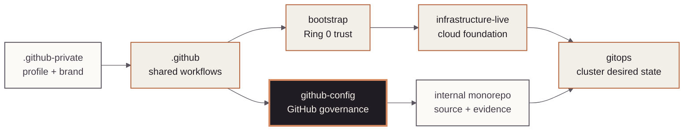

<!-- mindclade-doc: repository-home@2 -->
<!-- Brand distribution: mindclade/.github-private/mindclade-brand-assets (MONO family). -->

<p align="center">
  <picture>
    <source media="(prefers-color-scheme: dark)" srcset="docs/assets/brand/mono-wordmark-dark-1080w.png">
    <source media="(prefers-color-scheme: light)" srcset="docs/assets/brand/mono-wordmark-1080w.png">
    
  </picture>
</p>

<p align="center">
  
  
  
  
</p>

# Mindclade · GitHub Configuration

> **Platform Foundation · GitHub governance control plane**
> Compile reviewed catalog policy into repositories, teams, access, rulesets, environments,
> Actions controls, and OIDC metadata.

| Repository contract | Value |
| --- | --- |
| Class | `enterprise-control` |
| Visibility | `private` |
| Change model | `pull-request` |
| Authority | `github-enterprise-governance`<br>`repositories`<br>`teams`<br>`access`<br>`rulesets`<br>`environments`<br>`actions-policy`<br>`oidc-policy` |
| Primary readers | GitHub platform, security, and access-governance maintainers |
| First success | [Validate catalog policy](#quick-start) |
| Start here | [`docs/README.md`](docs/README.md) |

## Mission

`github-config` is the source of truth for Mindclade GitHub Enterprise desired state. Security
and platform maintainers author policy in `catalog/`; provider-free checks and Terraform
compile that catalog into governed GitHub resources.

## Authority boundary

### This repository creates

- Repository inventory, visibility, lifecycle, custom properties, and protected environments.
- Teams, team-based access, rulesets, Actions policy, and OIDC metadata.
- Drift detection and documented manual-control expectations.

### This repository deliberately does not create

- Reusable workflow implementations or community-health content; those belong to `.github`.
- Google Cloud resources; those belong to `bootstrap` and `infrastructure-live`.
- Kubernetes desired state or product source; those belong to `gitops` and the monorepo.

## Quick start

Prerequisite: Nix with flakes enabled. These checks need no GitHub credentials and do not change
organization or repository settings.

```sh
nix develop .#ci --command make validate
nix develop .#ci --command make test
nix flake check --no-update-lock-file
make qualify-github-platform
```

**Success means:** catalog schemas, access expiry, cross-references, Terraform formatting and
tests, security checks, and the repository contract all pass.

**If it fails:** correct the human-authored source in `catalog/` first; do not hand-edit compiled
Terraform output to silence a schema, ownership, or access error.

**Safety boundary:** do not apply Terraform, alter live settings, refresh credentials, or widen
access from a development session.

## Estate position

The highlighted node is this repository. Its contract and exclusions provide a text equivalent
for the governance relationships shown below.



## Repository map

| Path | Purpose |
| --- | --- |
| `catalog/` | Human-authored organization policy, App contracts, and adoption evidence. |
| `catalog/schema/` | Machine-readable catalog contracts. |
| `modules/catalog/` | Provider-free normalization and cross-reference checks. |
| `modules/repositories/` | Repositories, properties, environments, and access. |
| `modules/rulesets/` | Organization and repository rulesets. |
| `modules/policies/` | Actions and organization policy. |
| `.github/workflows/` | Plan, protected apply, drift, and contract gates. |
| `catalog/workflow-adoption.yaml` | Producer/consumer pins, permissions, and activation gates. |
| `scripts/qualify-github-platform.py` | Three-repository qualification and JSON/Markdown report. |

## Change path

Review begins with the catalog diff and provider-free validation. Pull requests may create a
credentialed speculative plan through a protected environment; after merge, CI creates a new
plan for the exact `main` commit and applies it only after governance approval. Deletions and
replacements fail closed unless an authorized operator provides the documented dispatch input.
Every protected plan also records a checksummed current-head/source/run/freshness contract with a
six-hour maximum. Head and age are rechecked before credentials and immediately before apply;
active applies remain non-cancellable. An older source requires an explicit current-`main`
`source_rollback` dispatch, a full strict-ancestor SHA, a change/incident reference, and the normal
governance approval. This source rollback is distinct from a merge-queue rollout-stage rollback.

## Documentation and support

- [Documentation home](docs/README.md)
- [Architecture](docs/architecture.md)
- [Access model](docs/access-model.md)
- [Actions policy](docs/actions-policy.md)
- [GitHub App authority contracts](docs/github-apps.md)
- [GitHub platform qualification](docs/github-platform-qualification.md)
- [Onboarding](docs/onboarding.md) and [offboarding](docs/offboarding.md)
- [Contributing](CONTRIBUTING.md)
- Policies and terms: [governance](GOVERNANCE.md) · [conduct](CODE_OF_CONDUCT.md) ·
  [support](SUPPORT.md) · [legal](LEGAL.md) · [license](LICENSE) · [notice](NOTICE) ·
  [changes](CHANGELOG.md)

## Security

Treat access, visibility, rulesets, identity, and protected paths as security changes. Never
print tokens, App keys, plan payloads, or sensitive drift output; use
[the private security process](SECURITY.md).
