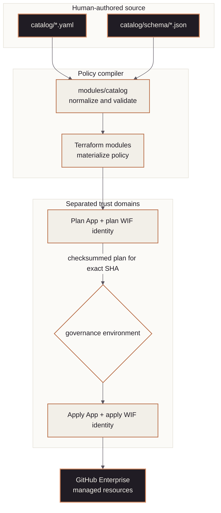

<!-- mindclade-doc: architecture@1 -->

# Mindclade · GitHub configuration architecture

> **Audience:** Security, platform, and infrastructure engineers
> **Outcome:** Understand the repository boundary, policy compiler, credential separation,
> and failure domains before changing GitHub governance.

## Context

`github-config` converts a small catalog of organization intent into GitHub Enterprise
resources. Catalog validation is provider-free so broken references fail before credentials
are requested. Terraform resources are implementation details of that policy compiler, not a
second human-authored source of truth.

## Authority boundary

### Owns

- organization and repository settings represented by the GitHub provider;
- repository inventory, custom properties, lifecycle, and class assignment;
- teams, team grants, access exceptions, environments, and rulesets;
- GitHub Actions restrictions and GitHub OIDC governance metadata; and
- planned application and drift evidence for managed resources.

### Depends on

- `.github` for the released mandatory and reusable workflow implementations;
- `bootstrap` for Terraform state and the initial GitHub-to-Google Cloud trust anchor;
- the corporate identity provider for human lifecycle and approved group membership; and
- protected GitHub environments for independent apply approval.

### Explicitly excludes

- reusable workflow implementation, Google Cloud resources, Kubernetes desired state,
  product source, secret values, and IdP account lifecycle.

## Component model

The diagram separates human intent, provider-free compilation, credentialed planning, and
credentialed mutation.

| Component | Responsibility | Source of truth |
| --- | --- | --- |
| Catalog | Organization intent and assignments | `catalog/*.yaml` |
| Catalog module | Schema, reference, and invariant checks | `modules/catalog/` |
| Bootstrap output compiler | Source-bound, non-secret repository-variable handoffs | `scripts/export-ci-variables.py` and `contracts/` |
| Resource modules | Compile normalized intent into provider resources | `modules/` |
| Plan workflow | Static gates, base-branch scope classification, stable verdict, and read-oriented speculative plan | `.github/workflows/plan.yml` |
| Apply workflow | Exact post-merge plan, approval, integrity check, apply | `.github/workflows/apply.yml` |

## Change flow

1. A pull request changes catalog intent and, only when necessary, compiler code.
2. CI lints workflows and YAML, validates catalog references and access expiry, checks
   Terraform, and runs tests. A base-branch classifier requests the protected speculative plan
   only for Terraform, state, trust, or plan-control changes; `plan / verdict` remains present for
   both outcomes.
3. Required rulesets and reviewers gate the merge.
4. The push to `main` creates a fresh saved plan for that exact commit.
5. The plan artifact records its checksum, repository, run, commit, rollout phase, exact
   enforcement override map, delete count, and replacement count and is retained for one day.
6. The protected `governance` environment gates the separately credentialed apply job.
7. The apply job verifies artifact integrity, commit provenance, and a freshly compiled match for
   the recorded rollout phase and overrides before applying the saved plan.

## Trust and security boundaries

Plan and apply use different GitHub Apps and Google Cloud identities. Private keys are
protected-environment secrets and never enter Terraform variables, catalog documents, or
saved plan values. Static jobs have no cloud identity. Catalog-managed teams receive no
repository `admin` grants, and direct user grants are limited to explicit, expiring access
exceptions.

Ruleset bypass is declared per ruleset in `modules/rulesets/bypass.tf`. Baseline, tag
protection, and blocked-file push controls have no bypass. Where bypass exists, it is
pull-request scoped; it does not grant an invisible direct-push path.

## Failure domains and recovery

| Failure | Expected containment | Recovery |
| --- | --- | --- |
| Invalid catalog reference | Provider-free validation fails | Correct catalog source and rerun validation |
| Speculative-plan failure | Pull request cannot merge | Diagnose without requesting mutation credentials |
| Documentation-only pull request | Stable verdict succeeds without a protected environment | Review static checks; no connected plan is expected |
| Post-merge plan failure | No apply job receives an artifact | Submit a reviewed forward fix |
| Apply failure | Workflow opens an incident issue | Inspect state lock and plan evidence; prefer forward recovery |
| Destructive plan on push | Apply fails before approval | Review the diff and manually dispatch only when deletion is intentional |
| Provider/API drift | Drift workflow reports divergence | Reconcile catalog or import the approved existing resource |

## Invariants

- `catalog/` remains the only human-authored policy source.
- Applied bootstrap handoffs are derived from a clean, exact bootstrap commit; catalog and direct
  downstream UI edits cannot author or override them.
- Repository classes and custom properties drive policy targeting; names are not policy.
- Plan and apply identities remain separate.
- Apply consumes the checksummed plan produced for the exact checked-out commit.
- Rollout phases compile to exact reviewed overrides; unknown or altered phase metadata fails.
- Connected exceptions are schema-backed, exact, read-only audit inputs—not hidden Terraform
  lifecycle ignores.
- Secret material never appears in catalog, tfvars, state outputs, plan summaries, or docs.
- Manual controls are recorded in [enterprise manual controls](enterprise-manual-controls.md).

## Related documentation

- [Access model](access-model.md)
- [Repository classes](repository-classes.md)
- [GitHub Actions policy](actions-policy.md)
- [OIDC governance](oidc.md)
- [GitHub break-glass](break-glass.md)
